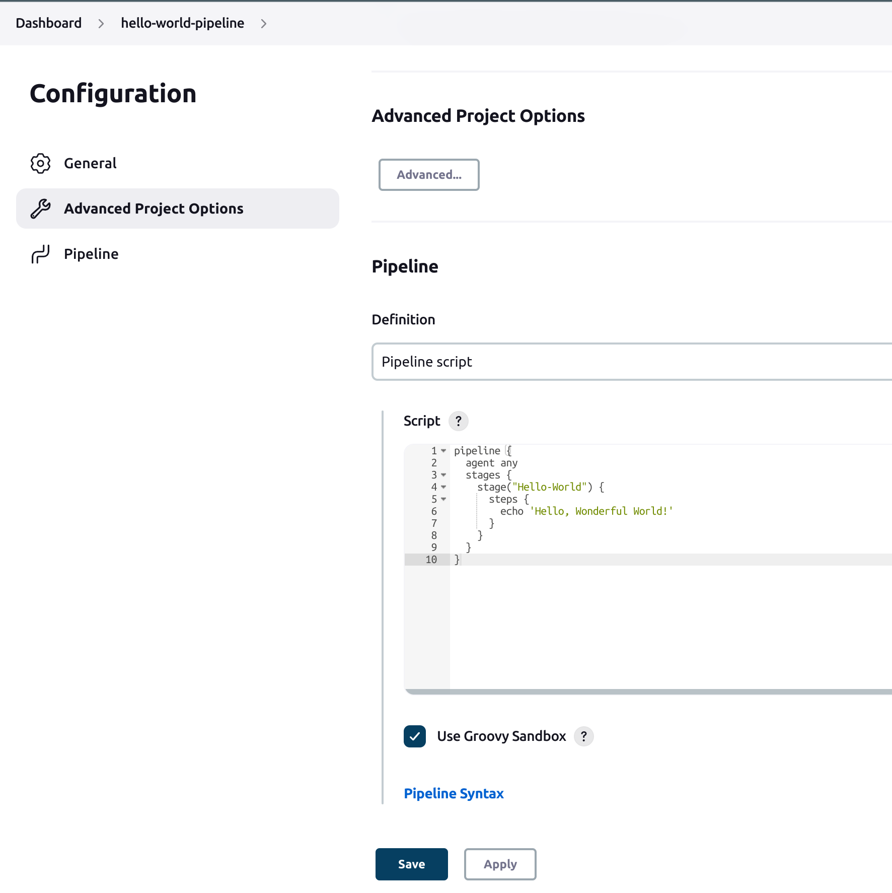
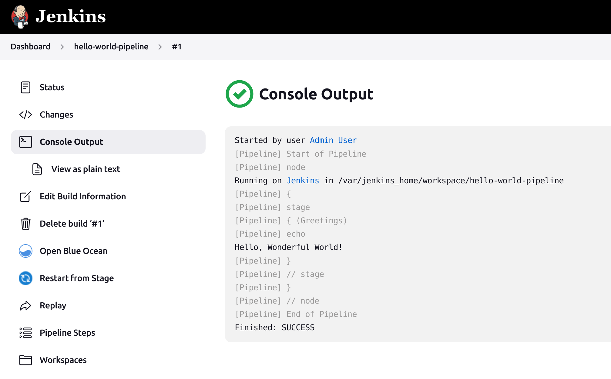

# :notebook: Hello Wonderful World! > Jenkins Pipeline
This is a script to display **"Hello Wonderful World!"** in **Jenkins Pipeline** programming language.

## :page_facing_up: Script

```groovy
pipeline {
  agent any
  stages {
    stage("Greetings") {
      steps {
        echo 'Hello, Wonderful World!'
      }
    }
  }
}
```

- :link: [hello-world.pipeline](hello-world.pipeline)

### Jenkins screen-shot examples
- Job configuration 
  
  

- Job console output
  
  

# :books: References
- :link: [Continuous Delivery with Docker and Jenkins](https://www.amazon.com/Continuous-Delivery-Docker-Jenkins-applications/dp/1838552189)