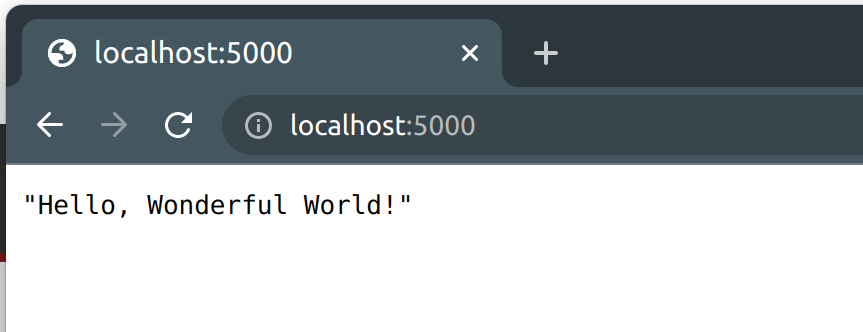

# :notebook: Hello Wonderful World! > Python with Flask and Docker
This is an application to display **"Hello, Wonderful World!"** with **Python**, **FLask** and **Docker**.

# Steps

Create the files below.

## `app.py`
```python
from flask import Flask

app = Flask(__name__)
```

## `rest.py`
```python
from app import app
from flask import jsonify, request

@app.route('/')
def hello_world():
    resp = jsonify('Hello, Wonderful World!')
    resp.status_code = 200
    return resp

if __name__ == "__main__":
  app.run(debug=True,host='0.0.0.0')
```

## `hello.dockerfile`
```docker
FROM python:3.10-alpine
COPY . /app
WORKDIR /app
RUN pip install -r requirements.txt
ENTRYPOINT ["python"]
CMD ["rest.py"]
```

## `requirements.txt`
```text
Flask==2.2.2
```

## `start.sh`
```bash
#!/bin/bash
# builds the docker image from the Docker file and tag it as 'python-flask-docker'
docker build -t python-flask-docker .

# Runs the Python Flask application
docker container run -p 5000:5000 python-flask-docker
```

|Script name| Description|Comments|
|--|--|--|
|[app.py](app.py)|Main Flask application|Creates an instance of **Flask** class|
|[rest.py](rest.py)|Rest API|Gives a response according to the [decorator route](https://flask.palletsprojects.com/en/2.2.x/patterns/viewdecorators/)|
|[Dockerile](Dockerfile)|Dockerfile|Builds **python-flask-docker** image|
|[requirements.txt](requirements.txt)|Requirements Python file|Takes the packages Python needs to install in order to run the application|
|[start.sh](start.sh)|BASH script to start the docker container|Starts the python-flask-docker container|

## :arrow_forward: Start the application
- Grant execution permissions to `start.sh`

  ```bash
  chmod +x start.sh
  ```

- Run the script below

  ```bash
  ./start.sh
  ```

- After open a browser and go to `http://localhost:5000/`

  

## :stop_button: Stop the application
```bash
CTRL + C # or close the terminal
```

# :books: References
- :link: [Python Docker Official Image](https://hub.docker.com/_/python)
- :link: [How to Create, Build, Package and Run Python Flask Application with Docker](https://roytuts.com/how-to-create-build-package-and-run-python-flask-application-with-docker/)
- :link: [Flask Web development, one drop at a time](https://flask.palletsprojects.com/en/2.2.x/)